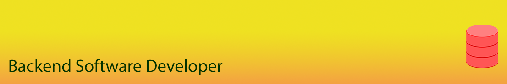

## Databases, Modeling Tools and Browsers

* [MySQL](https://www.mysql.com/), [MariaDB](https://mariadb.org/), [SQLite](https://www.sqlite.org/)
* Earlier: [PostgreSQL](https://www.postgresql.org/)
* Database Diagramming with: [DBSchema](https://dbschema.com/), [Workbench](https://www.mysql.com/products/workbench/design/)
* Database Browsers: [HeidiSQL](https://www.heidisql.com/), [SQLYog Community](https://github.com/webyog/sqlyog-community/wiki/Downloads), [DB Browser for SQLite](https://sqlitebrowser.org), [DataGrip](https://www.jetbrains.com/datagrip/)
* [PHPMyAdmin](https://www.phpmyadmin.net/), [PHP Lite Admin](https://www.phpliteadmin.org/)

## Team Leadership in Software Development

* Software Analysis
* Project Management
* [OpenCart E-Commerce](https://www.opencart.com/)
* [Paypal](https://www.paypal.com/), Payment API and Gateways Integration

## Core Web Development

* C#, [PHP](https://php.net/), [Python](https://python.org/)
* Javascripts, [AngularJS](https://angularjs.org/), [Axios](https://github.com/axios/axios/)
* CSS: [W3CSS](https://www.w3schools.com/w3css/default.asp)
* [JSON](https://www.json.org/json-en.html), XML, CSV, HTML
* API, [Micro Services](https://github.com/anytizer/micro-services.wp/tree/master/micro-services)

## Font and Logo Development

* [BirdFont](https://birdfont.org/): [examples](https://github.com/anytizer/fonts/tree/master/fruits) of tracing fruits
* [FontForge](https://fontforge.org/en-US/)
* [AAA Logo Design Software](https://www.aaa-logo.com/)

## Audio, Video, Image Editing and Photography

* [LMMS](https://lmms.io/)
* [Audacity](https://www.audacityteam.org)
* [Studio One Prime](https://shop.presonus.com/Studio-One-5-Prime)
* [Filmora](https://filmora.wondershare.com/)
* [ACDSee](https://www.acdsee.com/en/products/photo-studio-ultimate/)
* [Photoshop](https://www.adobe.com/products/photoshop.html)

## DIY Electronics

* [Raspberry Pi](https://www.raspberrypi.org/)
* [Arduino](https://www.arduino.cc/)
* Basic Hardware, [Fritzing](https://fritzing.org/)

## Debugging and Unit Testing

* [Xdebbug](https://xdebug.org/)
* [PHPUnit](https://phpunit.de/)
* [MSTest](https://docs.microsoft.com/en-us/dotnet/core/testing/unit-testing-with-mstest)

## IDEs and Code Editors

* [Visual Studio](https://visualstudio.microsoft.com/)
* [Netbeans](https://netbeans.apache.org/)
* [PyCharm](https://www.jetbrains.com/pycharm/)
* [PHPStorm](https://www.jetbrains.com/phpstorm/)
* [Notepad++](https://notepad-plus-plus.org)
* [Visual Code](https://code.visualstudio.com/)

## Wireframes and Diagramming Tools

* [yEd Graph Editor](https://www.yworks.com/products/yed/)
* [Pencil](https://pencil.evolus.vn/)
* [Balsamiq](https://balsamiq.com/)

## Browsers, Connectors and Terminals
* [Opera](https://www.opera.com/)
* [Chrome](https://www.google.com/intl/en_ca/chrome/)
* [Firefox](https://www.mozilla.org/en-US/)
* [FileZilla](https://filezilla-project.org/) Client/Server
* [SmarTTY](https://sysprogs.com/SmarTTY/) - multi-tabbed SSH client
* [ConEmu Windows Terminal](https://conemu.github.io/)

## Collaboration Tools
* [Redmine](https://www.redmine.org/)
* [MantisBT](https://www.mantisbt.org/)
* [OnlyOffice](https://www.onlyoffice.com)

## Version Control, DevOps

* Self hosted: SVN, Git
* [GitHub](https://github.com/)
* [BitBucket](https://bitbucket.org/)
* [TrortoiseSVN](https://tortoisesvn.net/downloads.html), [TortoiseGit](https://tortoisegit.org/download/)

## Credits

* [Database Image](https://pixabay.com/vectors/database-storage-cylinder-data-2025620/)
* [Background Light](https://pixabay.com/vectors/database-storage-cylinder-data-2025620/)
* [GitHub](https://github.com/)

## Profiles Links

* [GitHub](https://github.com/anytizer/) - Projects
* [WordPress](https://profiles.wordpress.org/pbimal/#content-plugins) - Plugins
* [LinkedIn](https://www.linkedin.com/in/bimalpoudel/)
* [Indeed](https://my.indeed.com/p/bimalp-1f7dcyx)
* [Stack Overflow](https://stackoverflow.com/users/2156512/bimal-poudel)
* [YouTube](https://www.youtube.com/) - pending
